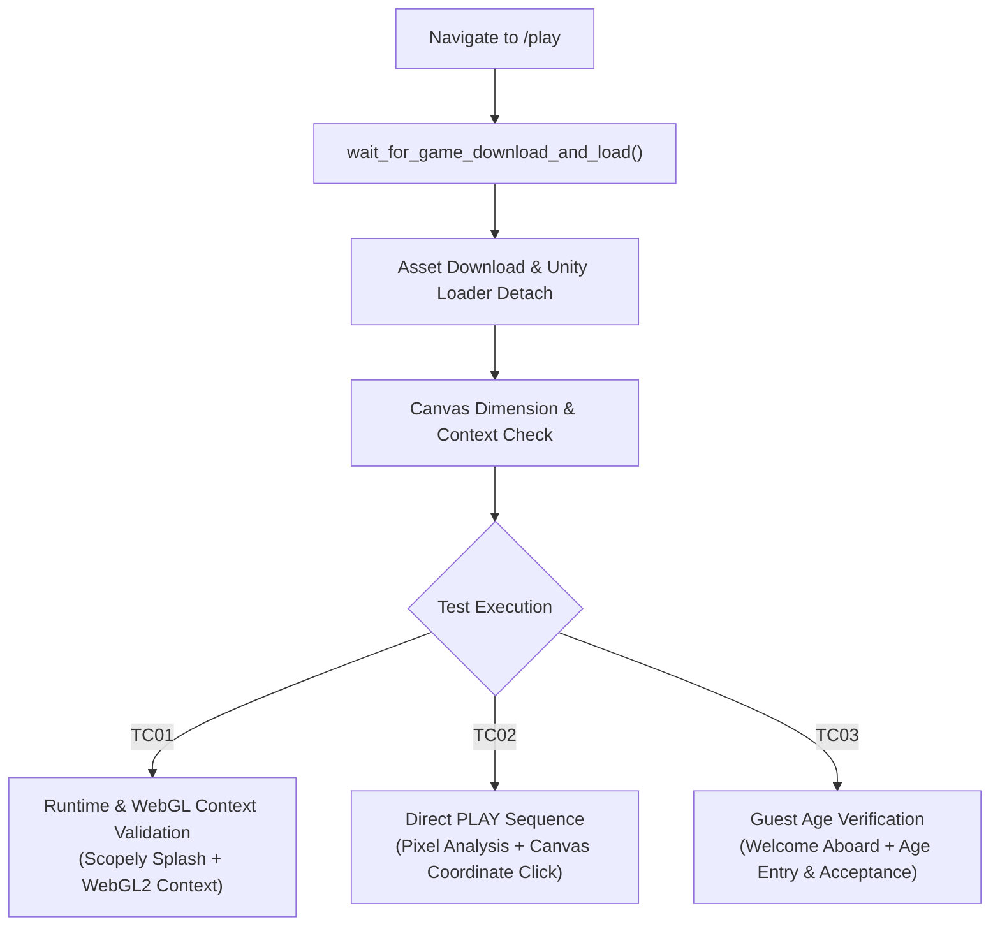

# Stumble Guys Automation Platform (`ui-test-platform`)

> **QA Automation Lead Assessment Submission for Mirai (a Scopely Company)**  
> **Author:** Candidate  
> **Target Portal:** [Stumble Guys Web Game Portal](https://www.stumbleguys.com/)

[](https://github.com/)
[](https://www.python.org/)
[](https://playwright.dev/python/)
[](https://github.com/astral-sh/ruff)
[](https://mypy-lang.org/)

---

## 1. Executive Summary & Architectural Vision

This repository presents **`ui-test-platform`**, an enterprise-grade UI automation framework engineered for modern web game portals, cross-platform responsiveness, and AI-assisted test authoring. 

Rather than a collection of ad-hoc test scripts, this platform demonstrates **QA Automation Lead architecture**:
- **Cross-Platform by Default:** A unified test suite runs seamlessly across **Desktop Web** (`--platform web`), **Mobile Web Emulation** (`--platform mobile-emulated`), and **Real Android Devices** (`--platform android-device`).
- **Strict Architectural Boundaries:** Enforced by Ruff `TID251` (tests can only import testing symbols from `ui_test_platform.fixtures.pom.test_options`).
- **Zero-Flakiness Policy:** Enforced by custom linter `make lint-waits` which strictly bans arbitrary `time.sleep` and `wait_for_timeout` across the entire codebase.
- **Bonus WebGL Canvas Game Automation:** Comprehensive strategy tackling the `/play` Unity WebGL canvas through container lifecycle evaluation, canvas context introspection, and viewport input dispatch.
- **Natural Language Test Authoring:** Integrated Cursor/Antigravity Rules (`.cursor/rules/`) and Skills (`.cursor/skills/`) enabling engineers and AI agents to reliably scaffold and append new tests purely from conversational prompts.

---

## 2. Test Coverage & Assessment Scenarios

| Area | Feature | Test Identifier | Platforms | Description |
| :--- | :--- | :--- | :--- | :--- |
| **Authentication** | Login Navigation & Trigger | `test_tc01_should_open_login_triggers_and_render_options` | Desktop + Mobile | Opens header avatar menu, triggers login dialog, and asserts login button rendering. |
| **Authentication** | Negative Form Validation | `test_tc02_should_validate_invalid_email_format` | Desktop + Mobile | Submits malformed credentials and asserts application stability without crashing. |
| **Authentication** | ID Provider Flow Integration | `test_tc03_should_automate_email_otp_retrieval_and_entry` | Desktop + Mobile | Provisions automated inbox, initiates login pipeline, and verifies Scopely ID prompt. |
| **Authentication** | Account Signup & Email Verify | `test_tc04_should_automate_new_account_signup_and_email_verification` | Desktop + Mobile | Provisions API mailbox, submits signup agreement, polls inbox, and verifies received confirmation link. |
| **Authentication** | End-to-End Signup & OTP Login | `test_tc05_should_complete_end_to_end_signup_and_otp_login` | Desktop + Mobile | **Full E2E Auth:** Mailbox creation $\to$ signup $\to$ email confirmation $\to$ OTP retrieval $\to$ OTP submission $\to$ portal redirection & cookie dismissal. |
| **Shop** | Catalog & Identity | `test_tc01_should_display_special_deals_and_validate_username` | Desktop + Mobile | Browses shop catalog, verifies special deals hero, and validates player username. |
| **Shop** | Safe Purchase Flow | `test_tc02_should_safely_cancel_purchase_flow_before_confirmation` | Desktop + Mobile | **Mandatory Assessment Requirement:** Selects offer, logs in via email OTP (`stumble_qa_173996@maxxspace.com`), attaches Xsolla payment frame, enters card details, verifies price & tax calculation, and safely cancels before payment confirmation. |
| **WebGL Game (Bonus)** | Canvas Runtime Init & Validation | `test_tc01_should_initialize_webgl_game_container` | Desktop | Navigates to `/play`, waits for game asset download & loader detach, verifies canvas rendering with non-zero dimensions, detects SCOPELY splash screen, checks WebGL2/WebGL context support, and captures screenshot. |
| **WebGL Game (Bonus)** | Direct Play Start Sequence | `test_tc02_should_verify_direct_play_and_start_game` | Desktop | Detects direct PLAY button on WebGL game portal/lobby via pixel analysis, dispatches coordinate-based canvas click, and verifies game responsiveness. |
| **WebGL Game (Bonus)** | Guest Onboarding & Age Gate | `test_tc03_should_handle_guest_age_verification` | Desktop | Unauthenticated guest flow: detects WELCOME ABOARD modal on canvas, clicks START PLAYING, sets player age to 25, accepts age verification, and verifies responsive canvas. |

### 🔑 Automated Disposable Email & OTP Pipeline (`TempMailClient`)
The authentication suite eliminates flaky hardcoded credentials and manual 2FA interventions by integrating an automated API-driven disposable mailbox service:
- **Zero Credentials Flake:** Dynamically provisions fresh isolated inboxes (`@uberip.com` / `mail.tm` API) per test run.
- **Link & OTP Extraction:** Asynchronously polls the automated inbox, parses HTML and text bodies to extract magic verification links and 6-digit Scopely ID OTP codes via regex.
- **Rate-Limit Resilient:** Gracefully detects public mail service rate-limits (`MailServiceRateLimitError`) to avoid false test failures.

---

## 3. Technology Stack

- **Core Engine:** Python (3.11+) + Playwright (Sync API) + Appium 2 (real Android Chrome via CDP attach)
- **Test Runner:** Pytest 8+, `pytest-playwright`, `pytest-xdist` (parallel execution with `filelock`), `pytest-split`
- **Linting & Formatting:** Ruff (strict linting, ban imports rule, formatting)
- **Type Safety:** Mypy (`strict = true`, no implicit `Any`, full type annotations)
- **Reporting:** Allure Framework (`allure-pytest`) with step-level BDD reporting and failure attachments
- **CI/CD:** GitHub Actions (`on-demand.yml`, `sanity.yml` targeting Desktop Web)
- **Containerization:** Docker (`Dockerfile`)

---

## 4. Step-by-Step Setup & Execution Guide

Follow these sequential steps to set up, configure, and run tests locally or on real devices.

### Step 1: Prerequisites

Make sure the following tools are installed on your machine:
- **Python 3.11+** (`python3 --version`)
- **Node.js 18+ & npm** (required only for Appium/Android execution: `node -v`, `npm -v`)
- **Android SDK & `adb`** (required only for real Android execution: `adb version`)
- **Allure CLI** (optional for viewing HTML reports: `brew install allure` or `npm install -g allure-commandline`)

---

### Step 2: Clone the Repository & Create Virtual Environment

```bash
# 1. Clone repository
git clone git@github.com:saleelm/automation-assesment.git
cd automation-assesment

# 2. Create Python virtual environment
python3 -m venv .venv

# 3. Activate virtual environment
# On macOS / Linux:
source .venv/bin/activate
# On Windows PowerShell:
# .venv\Scripts\Activate.ps1
```

---

### Step 3: Install Python Dependencies & Playwright Browsers

```bash
# 1. Install project dependencies in editable mode
make install-dev
# or: pip install -e ".[dev]"

# 2. Install Playwright Chromium browser binary
playwright install chromium
```

---

### Step 4: (Optional) Install and Setup ADB & Android SDK
 
To run tests against real Android devices or Android emulators (`--platform android-device`), `adb` (Android Debug Bridge) is required.

#### Option A: Quick Install via Homebrew (macOS)
```bash
brew install android-platform-tools
```

#### Option B: Via Android Studio SDK (macOS / Linux / Windows)
If Android Studio is already installed, add the platform-tools directory to your shell PATH:

- **macOS (`~/.zshrc`):**
  ```bash
  export ANDROID_HOME=$HOME/Library/Android/sdk
  export PATH=$ANDROID_HOME/platform-tools:$ANDROID_HOME/emulator:$PATH
  ```
  Apply changes:
  ```bash
  source ~/.zshrc
  ```

- **Linux (`~/.bashrc`):**
  ```bash
  export ANDROID_HOME=$HOME/Android/Sdk
  export PATH=$ANDROID_HOME/platform-tools:$ANDROID_HOME/emulator:$PATH
  ```
  Apply changes:
  ```bash
  source ~/.bashrc
  ```

#### Verify ADB Installation:
```bash
adb version
```

---

### Step 5: (Optional) Setup Appium 2 & Start Device / Emulator

1. **Install Appium 2 & UiAutomator2 driver:**
   ```bash
   make install-appium
   ```

2. **Connect a Real Android Device OR Start an Android Emulator:**
   - **Real Device:**
     - Enable **Developer Options** and **USB Debugging** on the phone.
     - Connect via USB and confirm the RSA authorization prompt.
   - **Android Emulator:**
     - List available AVDs:
       ```bash
       emulator -list-avds
       ```
     - Start emulator (e.g., `Medium_Phone`):
       ```bash
       emulator -avd Medium_Phone &
       ```

3. **Verify Device/Emulator is Detected by ADB:**
   ```bash
   adb devices
   ```
   *(Ensure the output lists your device/emulator with status `device`, e.g., `emulator-5554 device` or `<serial> device`).*

4. Ensure Google Chrome is installed and up-to-date on the device/emulator.

---

### Step 6: Running Tests

You can run the suite across different platforms and granular test tags:

#### 1. Desktop Web (Default)
```bash
# Using Makefile shortcut:
make test-web

# Or directly with pytest:
pytest --platform web
```

#### 2. Mobile Web Emulation (Pixel 7 / iPhone Viewport & Touch Events)
```bash
# Using Makefile shortcut:
make test-mobile

# Or directly with pytest:
pytest --platform mobile-emulated
```

#### 3. Real Android Device via Appium + CDP Attach
```bash
# Ensure Appium server is running (or pytest will auto-spawn it)
make appium

# In another terminal (with .venv activated):
make test-android
# Or specify explicit device UDID and Appium port:
# ANDROID_SERIAL=<device_udid> APPIUM_PORT=4723 pytest --platform android-device
```

#### 4. Run by Feature Marker / Tag
```bash
# Authentication tests
make test-auth
# or: pytest -m auth

# Shop & Safe Purchase tests
pytest -m shop

# WebGL Game Canvas tests
make test-game
# or: pytest -m game
# or: pytest tests/game/test_webgl_game.py

# Smoke suite
make test-smoke

# Sanity suite
make test-sanity
```

#### 5. Headed Mode (Watch Browser Execution)
```bash
pytest --platform web --headed
```

---

### Step 7: Code Quality & Static Analysis Gates

Run quality verification to ensure linting, zero-wait policies, and strict types pass:

```bash
# 1. Run Ruff linter and zero-wait enforcement (bans time.sleep and wait_for_timeout)
make lint

# 2. Run Mypy strict type checking
make typecheck

# 3. Check code formatting
make format-check

# 4. Auto-format code
make format
```

---

### Step 8: Generating and Viewing Allure Reports

After running tests with `--alluredir=allure-results`:

```bash
# Generate static HTML report
make report-allure

# Open interactive Allure report in your default browser
make report-allure-open

# Or serve live directly from test results
make report
```

---

### Step 9: Running in Docker

Run the entire suite in a reproducible headless container:

```bash
# Build Docker image
docker build -t ui-test-platform .

# Run test suite inside container
docker run --rm -v $(pwd)/allure-results:/app/allure-results ui-test-platform
```

---

### Step 10: CI/CD Pipeline (GitHub Actions)

The CI/CD pipeline runs on GitHub Actions:
- **Sanity Workflow (`.github/workflows/sanity.yml`):** Automatically triggered on every Push, PR, and daily schedule. Executes the sanity test suite against the **Desktop Web** platform in headless mode.
- **On-Demand Workflow (`.github/workflows/on-demand.yml`):** Manually triggered via GitHub UI (`workflow_dispatch`) with customizable parameters (environment, marker filter) targeting the **Desktop Web** platform.

---

## 5. WebGL Game Canvas Automation (`/play`)

### The Challenge
Traditional test automation frameworks (Selenium, Cypress, standard Playwright locators) interact exclusively with the DOM tree. A Unity WebGL game renders inside a `<canvas>` element (`#react-unity-webgl-canvas-1`) as an internal pixel buffer, making in-game UI buttons, splash screens, lobbies, and modals completely invisible to standard DOM selectors.

### Test Scenarios (`tests/game/test_webgl_game.py`)

The platform includes a dedicated game test suite with 3 comprehensive test cases implemented in `TestWebGLGamePortal`:

#### 1. TC01: WebGL Container Initialization & Runtime Verification
- **Test:** `test_tc01_should_initialize_webgl_game_container`
- **Tags:** `@tags(Tag.SMOKE, Tag.GAME, Tag.WEBGL, Tag.WEB_ONLY)`
- **Prerequisite:** Navigates to `/play`, handles initial download prompt if presented, waits for the Unity loader (running stumbler animation / progress bar) to finish and detach, and confirms active rendering dimensions.
- **Assertions:**
  - Game `<canvas>` is visible with non-zero width and height (`is_canvas_rendered`).
  - SCOPELY splash screen is detected on the canvas via pixel sampling (`is_scopely_splash_displayed`).
  - Fullscreen button and navigation PLAY button are visible in the surrounding portal.
  - Browser engine supports active `webgl2` or `webgl` context (`is_webgl_supported`).
  - WebGL portal reaches a confirmed playable state.
  - Captures verified screenshot: `screenshots/tc01_webgl_game_assertion.png`.

#### 2. TC02: Direct Play Initiation & Game Start Sequence
- **Test:** `test_tc02_should_verify_direct_play_and_start_game`
- **Tags:** `@tags(Tag.E2E, Tag.GAME, Tag.WEBGL, Tag.WEB_ONLY)`
- **Workflow:**
  - Evaluates canvas pixel buffer to detect the prominent in-game lobby PLAY button (`is_direct_play_button_displayed`).
  - Dispatches coordinate-based click to the PLAY action button area (`click_direct_play` targeting relative coordinates `x: 0.87, y: 0.87`).
  - Asserts the game canvas and fullscreen controls remain active and responsive during the transition.
  - Captures visual proof: `screenshots/tc02_after_direct_play.png`.

#### 3. TC03: Guest Onboarding & Age Verification Sequence
- **Test:** `test_tc03_should_handle_guest_age_verification`
- **Tags:** `@pytest.mark.unauthenticated`, `@tags(Tag.E2E, Tag.GAME, Tag.WEBGL, Tag.WEB_ONLY)`
- **Workflow:**
  - Detects the initial in-game **WELCOME ABOARD** modal on the canvas (`is_welcome_aboard_displayed`).
  - Clicks **START PLAYING!** at relative coordinates `(x: 0.50, y: 0.51)`.
  - Handles the player age gate (`set_age_and_accept`): checks for DOM overlays or inputs the age (`25`) directly into the canvas input area, confirms with `Enter`, and accepts via the confirm button area `(x: 0.50, y: 0.62)`.
  - Verifies the game canvas remains active, responsive, and ready for gameplay.
  - Captures evidence: `screenshots/tc03_after_age_acceptance.png`.

---

### The Lead-Grade Solution Architecture (`WebGLGamePage`)

The implementation in [`WebGLGamePage`](file:///src/ui_test_platform/pages/stumbleguys/webgl_game_page.py) demonstrates enterprise game automation patterns:



1. **Lifecycle & Loader Synchronization (`wait_for_game_download_and_load`):**
   - Automatically handles the "Download" prompt if presented on initial load.
   - Waits for the Unity loader (running stumbler animation) to cleanly detach from the DOM.
   - Evaluates `canvas.width > 0 && canvas.height > 0` to verify active rendering.

2. **Visual State Detection via Pixel Buffer Sampling (Pillow):**
   - **Scopely Splash Detection (`_check_scopely_blue`):** Samples central canvas pixel buffers for the signature Scopely blue hue (`r < 35, 100 < g < 170, b > 210`) to confirm engine boot.
   - **Welcome Aboard Modal (`is_welcome_aboard_displayed`):** Samples the golden "START PLAYING!" button coordinates (`r > 220, 140 < g < 215, b < 110`).
   - **Direct PLAY Button (`is_direct_play_button_displayed`):** Detects the vibrant green/gold lobby action button in the bottom-right viewport quadrant (`~75%-95% width, ~78%-95% height`).

3. **Proportional Coordinate Input Dispatch:**
   - Clicks are calculated proportionally against runtime canvas bounding boxes (`FloatRect`), making interaction points fully responsive across arbitrary screen resolutions and DPI scaling factors.

4. **Browser WebGL Context Introspection:**
   - Injects JavaScript to evaluate `HTMLCanvasElement.getContext('webgl2') || getContext('webgl')`, directly validating the browser engine's GPU rendering pipeline.

---

### Running Game Test Cases

```bash
# Run the entire WebGL game test suite
make test-game
# or: pytest tests/game/test_webgl_game.py

# Run by marker
pytest -m game

# Run individual game test cases
pytest tests/game/test_webgl_game.py -k "test_tc01"
pytest tests/game/test_webgl_game.py -k "test_tc02"
pytest tests/game/test_webgl_game.py -k "test_tc03"

# Run in headed mode to observe canvas rendering live
pytest tests/game/test_webgl_game.py --headed
```

---

## 6. Authoring Tests with Plain-English Prompts (AI-Augmented QA)

The repository includes `.cursor/rules/` and `.cursor/skills/`. Any AI coding assistant (Antigravity, Cursor, Copilot) can author new tests directly from prompts such as:

> *"Add a test case: User selects an offer and validates that the price tag matches USD currency format."*

The assistant automatically:
1. Discovers the DOM element across desktop and mobile viewports.
2. Extends `ShopPage` in `src/ui_test_platform/pages/stumbleguys/shop_page.py`.
3. Injects the test under `tests/shop/` importing exclusively from `test_options.py`.
4. Runs `make lint` and `make typecheck` to ensure zero compilation or styling errors.

---

## 7. Assumptions & Limitations

1. **Authentication Mode:** The Stumble Guys web portal uses dynamic OAuth/Scopely ID modal interactions and Usercentrics CMP cookie banners. The framework includes proactive banner dismissal and negative credential validation flows.
2. **Safe Purchase Constraint:** In strict adherence to assessment rules, all purchase flows terminate before payment confirmation or submission of credit card details.
3. **Real Device Execution:** `--platform android-device` uses **Appium 2 + UiAutomator2** to launch Chrome on a real device or emulator, then attaches Playwright over CDP so the same Page Objects run unchanged.
4. **CI Scope:** Continuous Integration pipelines (GitHub Actions) run on headless Linux runners targeting the **Desktop Web** platform for high-speed, deterministic verification.
